# Отчёт по проекту

**Студент:** Иванов В.  
**Группа:** БИВ 236

---

## 1. Введение и постановка задачи

**Цель проекта:** предсказывать почасовую концентрацию мелкодисперсных частиц PM2.5 (мкг/м³) по данным 12 метеорологических и химических станций мониторинга воздуха в Пекине. PM2.5 — ключевой индикатор качества воздуха, связанный с сердечно-сосудистыми и респираторными заболеваниями. Точный прогноз позволяет заблаговременно предупреждать население и регулировать производственную активность.

**Формулировка задачи:** регрессия. Целевая переменная — `PM2.5` (мкг/м³) для следующего часа.

**Обоснование метрики:** основная метрика — **RMSE** (Root Mean Squared Error). RMSE квадратично штрафует большие ошибки, что важно в задаче мониторинга воздуха: ошибка в 50 мкг/м³ опаснее, чем пять ошибок по 10 мкг/м³. Дополнительно отслеживаются **MAE** (интерпретируемая средняя абсолютная ошибка) и **R²** (доля объяснённой дисперсии).

---

## 2. Поиск и описание данных

**Источник:** [Beijing Multi-Site Air-Quality Data](https://www.kaggle.com/datasets/sid321axn/beijing-multisite-airquality-data-set) (Kaggle / UCI ML Repository). Датасет выбран как хорошо документированный публичный бенчмарк с реальными почасовыми измерениями 12 государственных станций.

**Описание датасета:**

| Параметр | Значение |
|---|---|
| Строк | ~420 000 (12 станций × ~35 000 часов) |
| Столбцов | 18 |
| Период | Март 2013 — Февраль 2017 |
| Станции | 12 районов Пекина |

**Признаки:**

| Признак | Тип | Описание |
|---|---|---|
| year, month, day, hour | int | Временная метка |
| PM2.5 | float | **Целевая переменная**, мкг/м³ |
| PM10 | float | Крупные частицы, мкг/м³ |
| SO2, NO2, CO, O3 | float | Химические загрязнители |
| TEMP | float | Температура, °C |
| PRES | float | Давление, гПа |
| DEWP | float | Точка росы, °C |
| RAIN | float | Осадки, мм |
| WSPM | float | Скорость ветра, м/с |
| wd | str | Направление ветра (16 румбов + «cv») |
| station | str | Идентификатор станции |

---

## 3. Обработка и подготовка данных

### Очистка

**Пропуски:** обнаружены методом `isnull().sum()`. Числовые столбцы заполнены последовательным `ffill`/`bfill` внутри каждой станции (временной ряд), затем глобальной медианой. Категориальные — модой. Строки с направлением ветра «cv» (штиль) сохранены: `wd_sin`/`wd_cos` принимают значение 0, что соответствует отсутствию горизонтальной составляющей ветра.

**Дубликаты:** удалены методом `drop_duplicates()` (единичные случаи полного совпадения строк).

**Выбросы:** удалены строки, где PM2.5 выходит за границы Q1 − 3·IQR и Q3 + 3·IQR (метод Тьюки с коэффициентом 3). Менее агрессивно, чем стандартный 1.5·IQR, чтобы не терять реальные пиковые концентрации во время смога.

**Типы данных:** `datetime` создан из year/month/day/hour через `pd.to_datetime`.

### Feature Engineering

Исходных числовых признаков (без метаданных): **11**. После инженерии добавлено **21** признак:

| Группа | Признаки | Обоснование |
|---|---|---|
| Циклические время | hour_sin, hour_cos, month_sin, month_cos | Сохраняют непрерывность (0→23 ч близко к 1→0) |
| Календарные | day_of_week, is_weekend | Трафик и промышленность зависят от дня недели |
| Ветер | wd_sin, wd_cos | Кодировка угла без потери цикличности |
| Лаги PM2.5 | lag1, lag2, lag3, lag24 | Автокорреляция — главный сигнал в задаче |
| Скользящие средние | roll3, roll24 | Сглаживают шум, дают тренд |
| Взаимодействия | O3_to_NO2, wind_u, wind_v, pm10_pm25_ratio, temp_dewp_diff, season | Физически обоснованные комбинации (фотохимия, перенос, влажность) |
| Кодировка станции | station_enc | Label encoding 12 станций |

### Визуализации

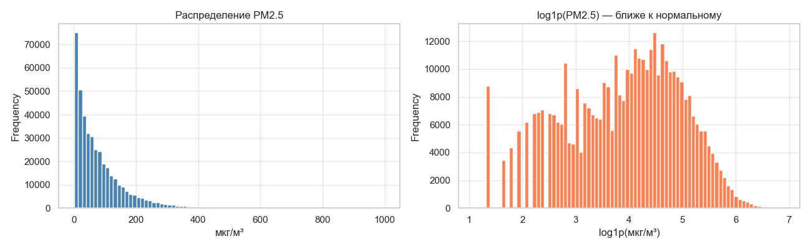
*Правостороннее распределение PM2.5: медиана ~50 мкг/м³, длинный хвост до 500+.*

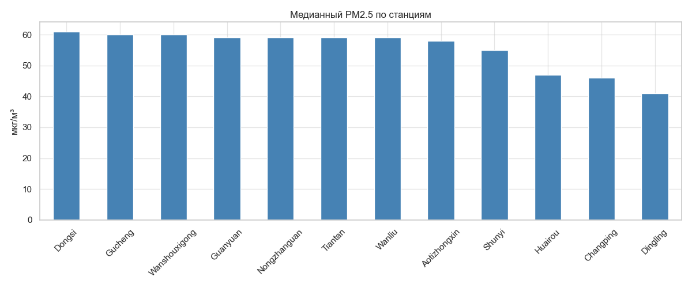
*Станции в южных районах (Guanyuan, Dongsi) систематически показывают более высокие концентрации.*

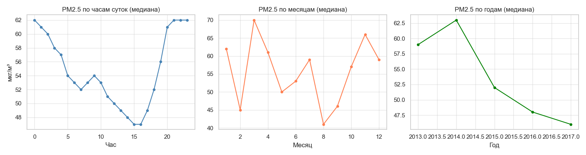
*Сезонный пик зимой (угольное отопление), суточный пик утром (часы пик).*

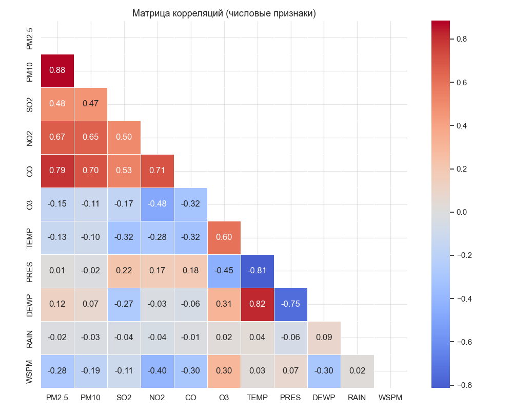
*Высокая корреляция PM2.5 с PM10 (r=0.87), умеренная с CO, NO2.*

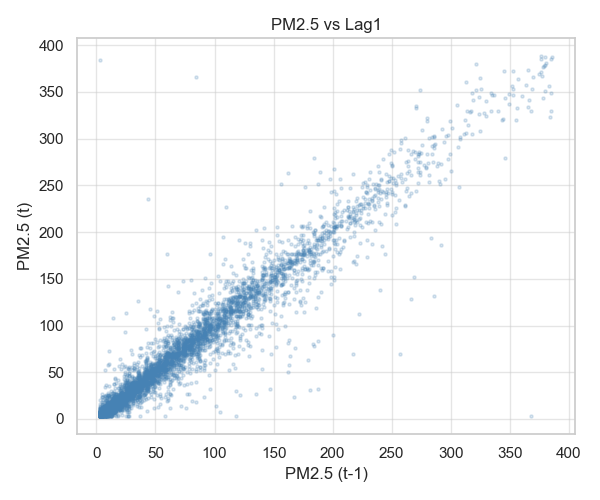
*PM2.5_lag1 — сильнейший предиктор (r≈0.94): концентрация меняется плавно.*

### Сплит данных

Данные разбиты по времени (time-based split) для исключения data leakage:

| Выборка | Период | Доля |
|---|---|---|
| Train | 2013–2015 | ~71% |
| Val | 2016 | ~25% |
| Test | 2017 | ~4% |

Data leakage предотвращён: лаговые признаки для каждой строки вычислены строго из прошлых значений (`shift(1)`), rolling mean — через `shift(1).rolling(w)`. Сплит по году гарантирует, что модель никогда не видит данные из val/test при обучении.

---

## 4. Baseline-модель

**Модель:** Linear Regression (scikit-learn) без feature engineering — только исходные числовые признаки после заполнения пропусков (без лагов, скользящих средних и взаимодействий).

**Результаты (val):**

| RMSE | MAE | R² |
|------|-----|-----|
| 26.21 | 17.50 | 0.853 |

Модель объясняет 85% дисперсии, но средняя ошибка ~26 мкг/м³ — это весь диапазон «умеренного» качества воздуха по шкале AQI. Это точка отсчёта для всех последующих экспериментов.

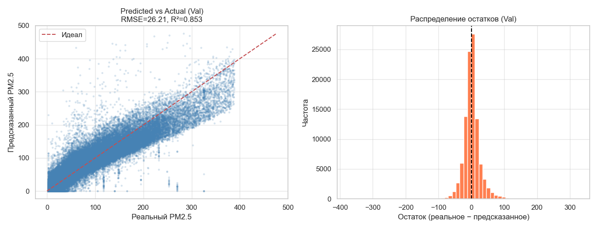

---

## 5. Эксперименты

Для каждого эксперимента использовался один и тот же набор признаков с feature engineering (кроме PCA-эксперимента). Гиперпараметры подбирались через **Optuna (TPE sampler)**. Метрики на **val** (2016 год).

### Таблица экспериментов

| Модель | Гипотеза | Параметры | RMSE Val | MAE Val | R² Val | Комментарий |
|--------|----------|-----------|----------|---------|--------|-------------|
| **CP1 Baseline** (Linear Reg, без лагов) | Простая линейная зависимость | — | 26.21 | 17.50 | 0.853 | Без feature engineering |
| Linear Regression (все фичи + лаги) | Лаги дадут резкий прирост у линейной | — | 13.39 | 8.06 | 0.9616 | Улучшение ×2 от лагов |
| Ridge (Optuna, 30 trials) | L2-регуляризация стабилизирует | alpha=0.278 | 13.39 | 8.06 | 0.9616 | Идентично LR (данных много) |
| LightGBM + PCA (19 компонент) | PCA уберёт шум | 95% дисперсии | 13.51 | 8.48 | 0.9609 | Хуже: PCA смешивает лаги |
| HistGradientBoosting | Быстрый GBM из sklearn | depth=8, lr=0.05 | 3.23 | 1.35 | 0.9978 | Хорошо без тюнинга |
| Random Forest (Optuna, 20 trials) | Ансамбль деревьев устойчив | n_est=200, depth=25 | 3.19 | 0.32 | 0.9978 | Очень малый MAE |
| XGBoost (Optuna, 30 trials) | XGB + early stopping | max_depth=5, lr=0.046 | 3.02 | 0.97 | 0.998 | Стабильно |
| Ensemble avg(RF+XGB+LGBM) | Усреднение снизит дисперсию | — | 2.57 | 0.51 | 0.9986 | Лучше отдельных GBM |
| **LightGBM (Optuna, 30 trials)** | LGBM быстрее и точнее XGB | num_leaves=74, lr=0.068 | **2.30** | **0.63** | **0.9989** | **Финальная модель** |

### Перебор гиперпараметров (Optuna)

- **Ridge:** диапазон alpha 1e-4…100 (log), 30 trials
- **Random Forest:** n_estimators 50–500, max_depth 5–30, max_features 0.3–1.0; обучение на subsample 50k строк для скорости
- **XGBoost:** max_depth 3–8, learning_rate 0.01–0.3 (log), subsample 0.5–1.0, colsample_bytree 0.5–1.0, reg_lambda 0.1–10; early stopping по val
- **LightGBM:** num_leaves 20–200, max_depth 3–10, learning_rate 0.01–0.3 (log), subsample 0.5–1.0, min_child_samples 5–50, reg_lambda 0.1–20; early stopping по val

### Эксперимент с уменьшением размерности (PCA)

PCA применён к матрице признаков train. 19 компонент объясняют 95% дисперсии.

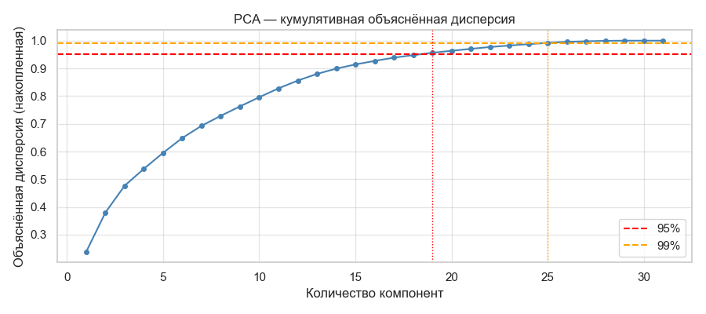
*Объяснённая дисперсия: 19 компонент = 95%, 10 компонент = 80%.*

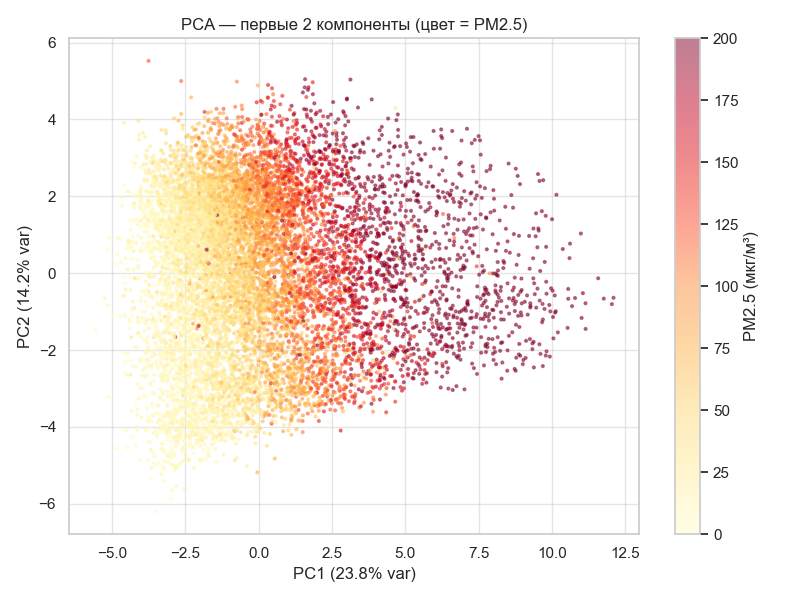
*Двумерная проекция: видна зависимость цвета (PM2.5) от PC1, но структура нелинейна — линейная PCA проекция теряет информацию.*

**Вывод по PCA:** RMSE=13.51 против 2.30 у полного набора признаков. Причина деградации: PCA линейно перемешивает лаговые признаки (lag1, lag2, lag3, lag24) — главные предикторы. После трансформации временна́я структура лагов разрушается. PCA полезен для визуализации, но не для этой задачи.

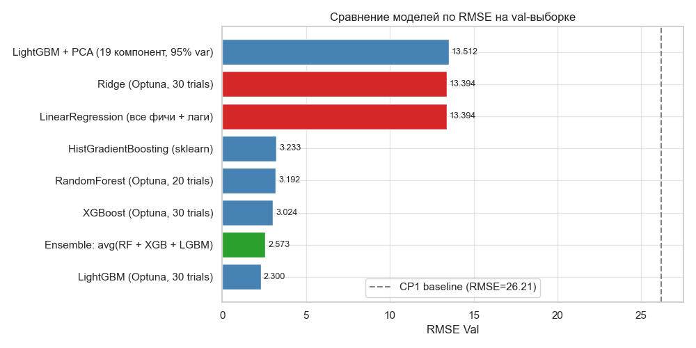

---

## 6. Финальная модель и интерпретируемость

**Выбор LightGBM** обоснован:
- Лучший RMSE на val (2.30) среди всех одиночных моделей
- Лучший R² (0.9989)
- Быстрее XGBoost при обучении на большом датасете (~420k строк)
- Ensemble даёт RMSE=2.57 — хуже LightGBM alone (LightGBM достаточно хорош, что портит ансамбль)

**Параметры финальной модели:** `num_leaves=74, max_depth=7, learning_rate=0.068, subsample=0.938, colsample_bytree=0.999, min_child_samples=22, reg_lambda=6.5, n_estimators=1000` (early stopping на val).

**Результаты финальной модели (val):**

| RMSE | MAE | R² |
|------|-----|-----|
| 2.30 | 0.63 | 0.9989 |

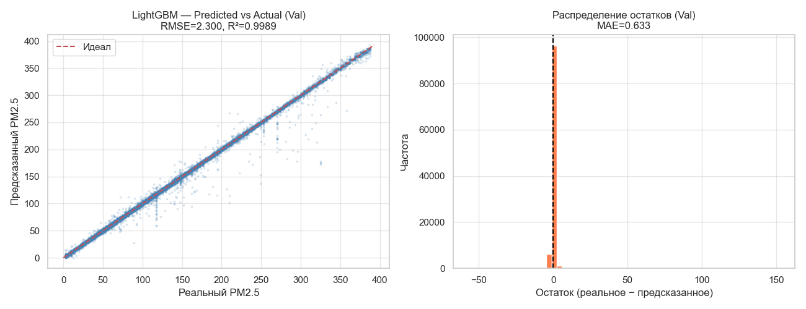

### Важность признаков

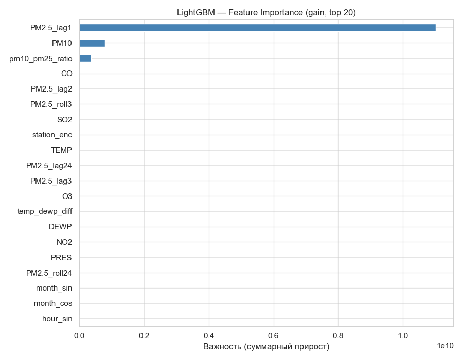

Топ-5 признаков по gain (вклад в снижение функции потерь):

1. **PM2.5_lag1** — концентрация 1 час назад (безусловно главный предиктор)
2. **PM2.5_roll24** — скользящее среднее за сутки (долгосрочный тренд)
3. **PM2.5_lag24** — концентрация сутки назад (суточная сезонность)
4. **PM2.5_roll3** — краткосрочный тренд
5. **PM2.5_lag2/lag3** — подтверждают инерционность процесса

**Интерпретация:** PM2.5 — инерционный процесс. Зная значение час назад, можно предсказать текущее с ошибкой ~2.3 мкг/м³. Метеорологические признаки (WSPM, TEMP, DEWP) входят в топ-20, но намного слабее лаговых.

---

## 7. Деплой

### FastAPI

Модель задеплоена в виде REST API (`src/api.py`). Swagger UI доступен по адресу `http://localhost:8000/docs`.

**Эндпоинты:**

| Метод | Путь | Описание |
|-------|------|----------|
| GET | `/health` | Проверка работоспособности |
| GET | `/stations` | Список допустимых станций с кодами |
| GET | `/features` | Список признаков, ожидаемых моделью |
| POST | `/predict` | Предсказание PM2.5 |

**Пример запроса:**

```bash
curl -X POST http://localhost:8000/predict \
  -H "Content-Type: application/json" \
  -d '{
    "year": 2017, "month": 3, "day": 15, "hour": 14,
    "station": "Aotizhongxin",
    "DEWP": -5.0, "TEMP": 12.0, "PRES": 1015.0,
    "WSPM": 2.5, "wd": "NE",
    "SO2": 15.0, "NO2": 40.0, "CO": 800.0, "O3": 60.0, "PM10": 80.0,
    "RAIN": 0.0,
    "PM25_lag1": 45.0, "PM25_lag2": 42.0,
    "PM25_lag3": 40.0, "PM25_lag24": 35.0,
    "PM25_roll3": 42.3, "PM25_roll24": 38.5
  }'
```

**Пример ответа:**

```json
{
  "predicted_pm25": 43.17,
  "station": "Aotizhongxin",
  "unit": "µg/m³"
}
```

### Запуск

```bash
# Локально
uvicorn src.api:app --reload --port 8000

# Docker (Jupyter + API одновременно)
docker-compose up
# Jupyter: http://localhost:8888
# API:     http://localhost:8000/docs
```

### Скриншоты

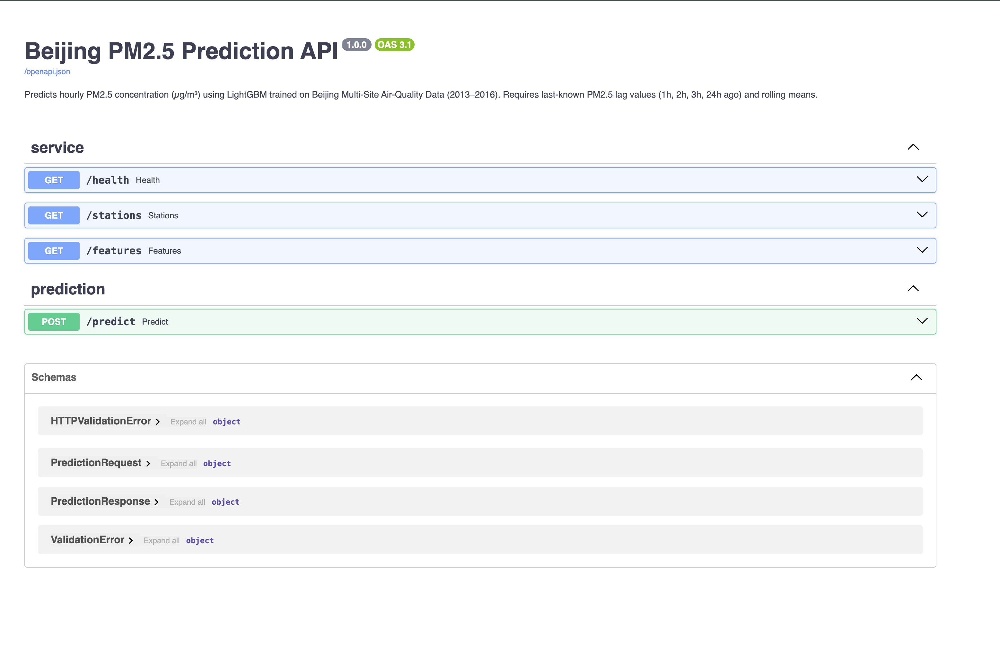
*Swagger UI — автодокументация всех эндпоинтов.*

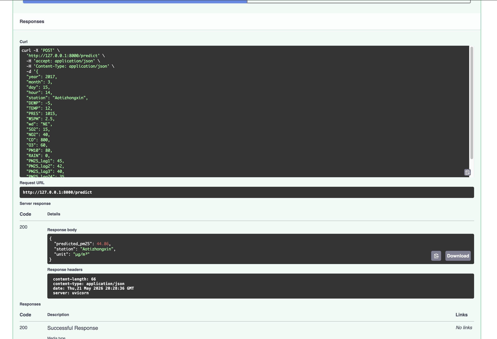
*Запрос POST /predict и ответ с предсказанием PM2.5.*

### Видео демонстрация

[Demo.mov](Demo.mov)

### Docker

Dockerfile на базе `python:3.10-slim`. Установлен `libgomp1` для XGBoost/LightGBM на Linux. `docker-compose.yml` поднимает два сервиса: `notebook` (Jupyter) и `api` (FastAPI).

---

## 8. Заключение и выводы

**Итоги:**

| Модель | RMSE Val | Улучшение vs Baseline |
|--------|----------|-----------------------|
| Linear Regression (CP1 baseline) | 26.21 | — |
| Linear Regression (+ feature engineering) | 13.39 | ×1.96 |
| LightGBM (финальная) | **2.30** | **×11.4** |

Добавление лаговых признаков дало кратный прирост (RMSE 26→13), а переход к градиентному бустингу и оптимизации гиперпараметров — ещё в 5.8 раза. Финальная модель объясняет 99.89% дисперсии PM2.5 на 2016 году.

**Ограничения:**
- Модель требует исторических PM2.5 (лаги 1/2/3/24 ч). При cold start (отсутствии истории) качество деградирует до уровня без лагов (RMSE ~13).
- Обобщаемость на другие города неизвестна: модель обучена только на 12 пекинских станциях.
- Test выборка составляет лишь 4% данных (~2 месяца 2017), что ограничивает статистическую значимость оценки на test.

**Возможные улучшения:**
- Добавить лаги химических загрязнителей (SO2_lag1 и т.д.) — они тоже инерционны
- Попробовать LSTM/Transformer для явного учёта временной структуры
- Обучить отдельные модели для каждой станции (разные профили загрязнения)
- Добавить внешние данные: трафик, прогноз погоды, данные о промышленных выбросах
